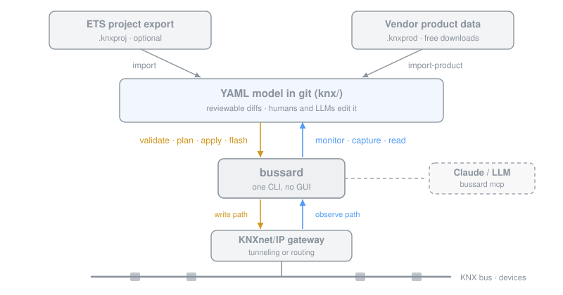

# 🪽 bussard

A buzzard circles the field and sees everything move. `bussard` does that for a KNX building: an open-source CLI that programs, watches, and decodes the bus. Built so an LLM can manage your KNX configuration with you.

All the configuration for your KNX setup is stored in YAML files, ready for your chat agent to modify them, creating reviewable diffs. `bussard` pushes the changes to the devices over your KNXnet/IP gateway. ETS stays in the drawer for the things only ETS can do (certification, planning, the odd exotic device).



<details>
<summary>Text version of the figure</summary>

```
.knxproj (ETS export)      .knxprod (vendor data)
      | import                   | import-product
      v                          v
 +--------------------------------------+
 |  YAML model in git (knx/)            |   reviewable diffs,
 +------------------+-------------------+   humans + LLMs edit it
     write path     |     observe path
  validate . plan   |   monitor . capture
  apply . flash     v   read
 +--------------------------------------+
 |  bussard  <---MCP---  Claude / LLM   |
 +------------------+-------------------+
                    |
         KNXnet/IP gateway <-> KNX bus
```

</details>

## Quickstart

Have an ETS export? Import it and watch your bus decode itself:

```console
$ bussard import demo-house.knxproj
imported 33 group addresses, 10 devices, 55 link entries → knx
$ bussard validate
0 errors, 4 warnings
$ bussard monitor
12:03:44.809  1.1.1 Push Button Hallway → 0/0/0 Hallway Light Switch = On (1.001, obj "Rocker 1")
12:03:44.981  1.1.3 Switch Actuator     → 0/0/1 Hallway Light Status = On (1.001)
```

No ETS project? Start empty and adopt devices as you go:

```console
$ bussard init
Found gateway: KNX IP Interface (192.0.2.10:3671, IA 1.1.250)
Created a fresh KNX model in knx.
$ bussard adopt --product actuator.knxprod    # press the programming button
adopted 15.15.255 → 1.1.5
$ bussard flash 1.1.5 --product actuator.knxprod   # ETS-free application download
```

From there you can explore all the functionality of bussard:

```console
$ bussard read 4/1/11                # 21.4 °C (9.001)
$ bussard write 3/0/4 down           # the blind moves
$ bussard plan 1.1.5                 # diff the device's live tables vs the model
$ bussard apply 1.1.5                # write them: confirm, backup, verify
$ bussard viz                        # the whole network in a browser, live
$ bussard ha-config --out ha.yaml    # Home Assistant config from the same model
$ claude mcp add knx -- bussard mcp --dir knx    # let Claude debug your bus
```

## Install

You will need a KNXnet/IP gateway (tunneling or routing). Optional but nice: your ETS project export (`.knxproj`) for an instantly named model, and also optionally vendor product data (`.knxprod`, free downloads from manufacturer sites) for commissioning new devices.

macOS and Linux:

```console
$ curl -fsSL https://raw.githubusercontent.com/tmbo/bussard/main/install.sh | sh
```

With Homebrew:

```console
$ brew install tmbo/tap/bussard
```

Windows:

```console
> winget install tmbo.bussard
```

or, in PowerShell:

```console
> irm https://raw.githubusercontent.com/tmbo/bussard/main/install.ps1 | iex
```

The installers download the binary for your machine, verify the published
SHA-256 checksum, and put `bussard` on your PATH. Set `BUSSARD_VERSION` to pin a
version and `BUSSARD_INSTALL_DIR` to choose where it lands.

Prefer to do it yourself? Grab a binary from the
[latest release](https://github.com/tmbo/bussard/releases/latest)
(Linux x64, Linux arm64, macOS arm64, macOS x64, Windows x64, each with a
`.sha256` checksum), or build from source:

```console
$ cargo install --path crates/bussard-cli
```

## Safety

`bussard` writes to physical building infrastructure. **Read
[docs/SAFETY.md](docs/SAFETY.md) before your first write** — it is the single
read-before-your-first-write guide (which bus you are hitting, the real-gateway
gate, backups, flash recovery, protected GAs, supported masks). The essentials:

- Writes to a non-loopback gateway are refused unless you opt in with `--allow-remote-gateway` (or `BUSSARD_ALLOW_REAL_GATEWAY=1`), and every write confirmation names the resolved gateway. Do your first real writes against a spare device or the simulator.
- A GA marked `protected: true` (wind alarm or central functions) is refused: the CLI needs `--force`. An LLM connecting to bussard over MCP has no override at all and cannot modify protected GAs.
- Every device write is plan-before-apply: bussard reads the live state, shows the diff, asks for confirmation, backs up (except `flash`), writes, and verifies.
- The MCP server has three tiers: passive (never transmits), read (default, rate-limited), write (opt-in via `--allow-writes`).

## Documentation

- [Safety](docs/SAFETY.md): read this before your first write.
- [Reference](docs/reference.md): every command, flag, YAML field, and MCP tool.
- [How do I ...](docs/howto.md): recipes, from watching the bus to flashing a device.
- [Design](docs/DESIGN.md): architecture, feasibility, roadmap.
- [Home Assistant](docs/ha-config.md): how `ha-config` derives entities.
- [Product data](docs/product-data.md): `.knxprod` handling and the pointer index.
- [Personas](docs/personas/README.md): who bussard is for, their journeys step by step, and the gaps as issue drafts.
- [Test campaign](docs/testing-campaign.md): the runbook for proving `bussard` against real hardware.

## Legal notes

Never commit `.knxproj` or `.knxprod` files: the application XML is the manufacturer's copyrighted work. You supply your own product files, free from manufacturer sites or the MyKNX catalogue ([details](docs/product-data.md)). `bussard` is an independent project, not affiliated with or certified by the KNX Association. KNX is a registered trademark of the KNX Association.

## License

[MIT](LICENSE)
